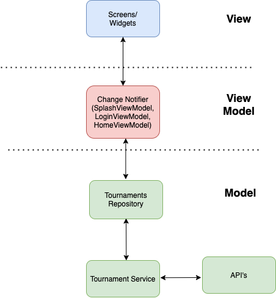
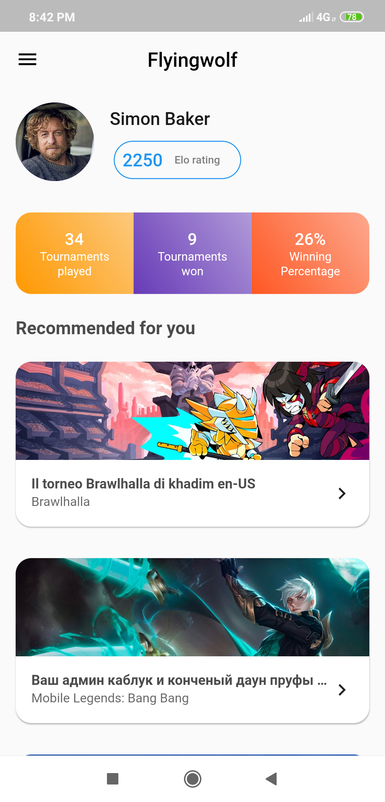

# Game.tv App
This is the simple game.tv app which list down the tournament details and user info.

# Architecture 

#### dependencies

- [http](https://pub.dev/packages/http) : Network Calls
- [provider](https://pub.dev/packages/provider)：State management
- [shared_preferences](https://pub.dev/packages/shared_preferences): Shared Preferences

### ScreenShot

!
!

### Supported devices

sdk: ">=2.7.0 <3.0.0"

### Supported features
- Login Screen
- User Details
- Tournaments 

### Requirements to build the app
**1. Login screen:**
  
    i. An image of game.tv logo
    ii. Username text field: It should have validation of min 3 characters and max 10 with proper error message if the validation fails.
    iii. Password field: It should have validation of min 3 characters and max 10 with proper error message if the validation fails.
    iv. Submit button: It should be disabled if either validation fails.
    
      
**2. Home screen:**
This will hold some information related to the logged in user, along with a few tournament cards.    
